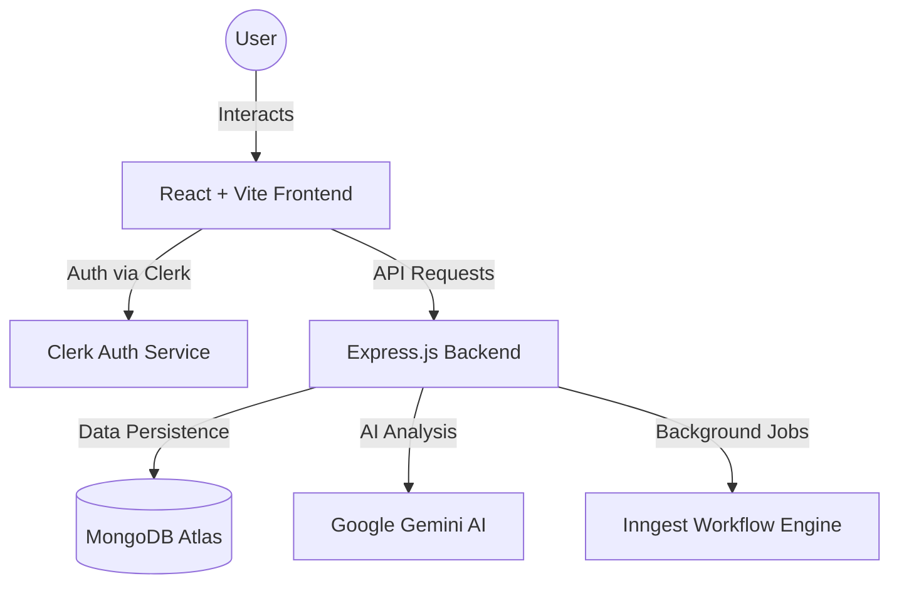

# Saarthi: Your Ultimate Career Charioteer 🏹 🤖

[](https://saarthi-pc0q.onrender.com)
[](https://vitejs.dev/)
[](https://reactjs.org/)
[](https://nodejs.org/)

**Saarthi** is a state-of-the-art career assistance platform designed to empower professionals and job seekers. Leveraging the power of **Google Gemini AI**, it provides intelligent solutions for resume building, cover letter generation, and real-time industry insights.

---

## 🌟 Key Features

### 📝 AI-Powered Resume Builder
- Dynamic content improvement using Gemini AI.
- Professional formatting and real-time previews.
- Tailored suggestions based on industry standards.

### ✉️ Intelligent Cover Letter Generator
- Generate personalized cover letters in seconds.
- Context-aware generation based on job descriptions and company profiles.

### 📊 Industry Insights & Trends
- Real-time data visualization of industry trends.
- AI-generated career advice and skill gap analysis.

### 🎯 Interview Preparation
- Customized technical quizzes for specific job categories.
- Detailed performance assessments and improvement tips.

---

## 🏗️ System Architecture



---

## 🛠️ Tech Stack

| Component | Technology |
| :--- | :--- |
| **Frontend** | React 18, Vite, Tailwind CSS, Lucide Icons, Recharts |
| **Backend** | Node.js, Express.js, MongoDB + Mongoose |
| **AI Layer** | Google Gemini 1.5 Flash API |
| **Auth** | Clerk (JWT based) |
| **Jobs** | Inngest (Serverless queues) |

---

## 🚀 Installation & Setup

### 1. Clone & Install
```bash
git clone https://github.com/SHUBHAMKUMAR1407/Saarthi.git
cd Saarthi
```

### 2. Backend Configuration
Navigate to `backend/` and create a `.env`:
```env
PORT=5000
DATABASE_URL=mongodb+srv://...
CLERK_SECRET_KEY=sk_test_...
CLERK_WEBHOOK_SECRET=whsec_...
GEMINI_API_KEY=AIzaSy...
```
```bash
npm install
npm run start
```

### 3. Frontend Configuration
Navigate to `frontend/` and create a `.env`:
```env
VITE_CLERK_PUBLISHABLE_KEY=pk_test_...
VITE_API_URL=https://your-backend-url/api
```
```bash
npm install
npm run dev
```

---

## 🔐 Security Information

We take security seriously. 
- All sensitive environment variables are managed via `.env` (strictly ignored by Git).
- Authentication is handled by **Clerk** using secure JWT tokens.
- Cross-Origin Resource Sharing (CORS) is configured for secure communication.

---

## 👨‍💻 Developer

**Shubham Kumar**
[](https://github.com/SHUBHAMKUMAR1407)

---

## 📄 License

This project is licensed under the [ISC License](LICENSE).

---
*Built with passion to help you find your professional north star.* 🌟
